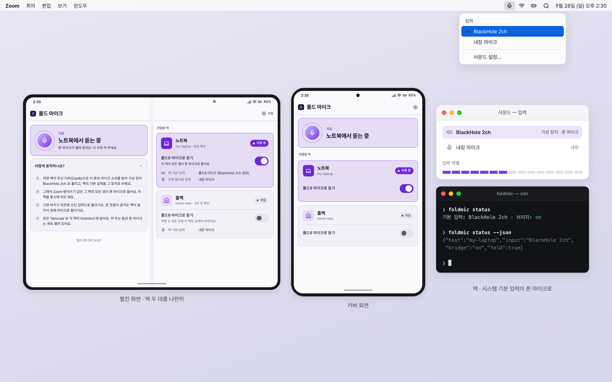
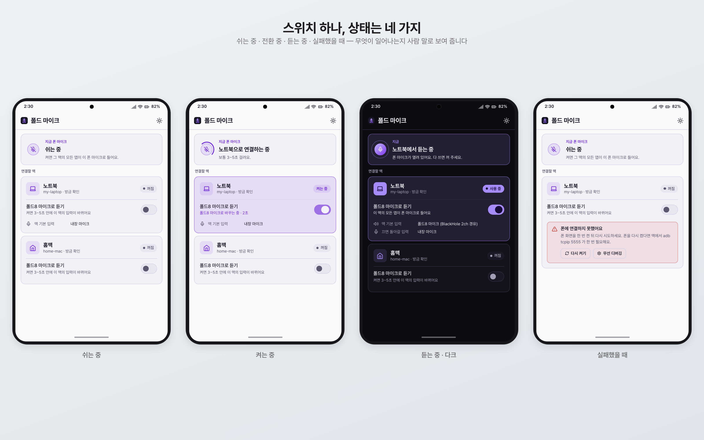
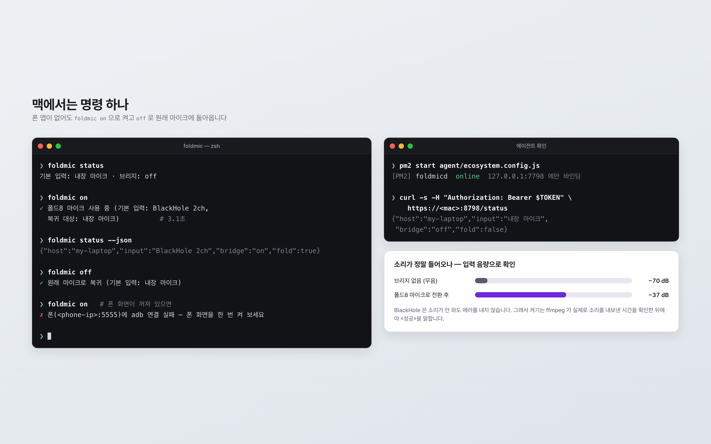
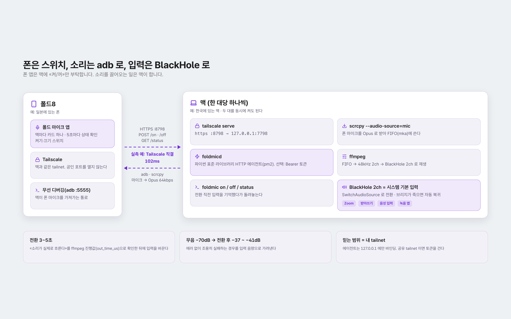
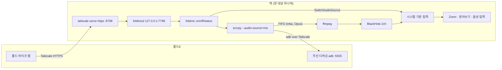

# foldmic

폰(Galaxy Z Fold8) 마이크를 맥의 **시스템 기본 입력**으로 바꿔 주는 CLI + 에이전트 + 안드로이드 앱.

> **English** — foldmic turns an Android phone's microphone into the macOS system default input, via scrcpy → ffmpeg → BlackHole 2ch.
> A tiny HTTP agent on each Mac lets a phone app switch it on and off over Tailscale, even when the phone is hundreds of km away.
> When the bridge dies, the Mac falls back to the input it was using before, so it never silently stays on a dead mic.

동작 확인: Galaxy Z Fold8 (Android 17) · macOS 26


화면은 설명용 목업입니다.

## 왜 만들었나

저는 10년 가까이 아이폰을 쓰다가 Galaxy Z Fold8 로 옮겼습니다. 맥과 아이폰 사이에서 당연하던 연동이 안드로이드에서는 비어 있어서, 필요한 것을 하나씩 직접 만들고 있습니다. foldmic 은 그중 하나입니다.

출발은 질문 하나였습니다. «Tailscale 로만 이어져 있으면, 다른 나라에 있는 폰 마이크를 맥 마이크로 쓸 수 있나?» 실제로 폰은 일본, 맥은 한국에 둔 상태에서 시험했고, 된다는 걸 확인한 뒤 매일 쓸 수 있게 앱까지 붙였습니다. 평소에는 각 맥의 원래 마이크를 쓰고, 필요할 때 폰에서 스위치를 켜면 그 맥의 모든 앱(Zoom·받아쓰기·음성 입력 등)이 폰 마이크로 듣습니다.

## 스크린샷


화면은 설명용 목업입니다.


화면은 설명용 목업입니다.


화면은 설명용 목업입니다.

## 기능

- **`foldmic on`** — 폰 마이크를 scrcpy(Opus 64kbps)로 받아 ffmpeg 로 BlackHole 2ch 에 흘리고, 맥의 기본 입력을 BlackHole 로 바꿉니다. 소리가 실제로 흐르는지(ffmpeg `out_time_us`) 확인한 뒤에야 성공을 알립니다.
- **`foldmic off`** — 바꾸기 직전에 쓰던 입력으로 돌아가고 브리지를 끕니다.
- **자동 복귀** — 폰 연결이 끊겨 브리지가 죽으면 기본 입력을 원래대로 되돌립니다. 조용한 마이크로 남지 않게.
- **`foldmic status [--json]`** — 기본 입력·브리지 상태.
- **foldmicd** — 파이썬 표준 라이브러리만 쓰는 HTTP 에이전트. `GET /status` · `POST /on` · `POST /off`, 감사 로그 `~/.local/state/foldmic/audit.log`. 선택적으로 Bearer 토큰 인증.
- **안드로이드 앱 「폴드 마이크」** — 맥마다 카드 하나, 화면이 보일 때만 5초마다 상태 확인, 켜는 중 경과 초 표시, 실패 원인을 사람 말로 보여 주고 «다시 시도»·«무선 디버깅»·«Tailscale» 바로가기를 붙입니다. 펼침(600dp 이상)에서는 카드를 나란히, 커버 화면에서는 세로로 쌓습니다. 라이트·다크·자동 테마.
- **두 맥 동시 사용** — 노트북과 다른 맥을 동시에 켜도 둘 다 들립니다(실측).

## 구조



| 경로 | 내용 |
|---|---|
| `bin/foldmic` | `on` · `off` · `status [--json]` (bash 3.2 호환) |
| `agent/foldmicd.py` | HTTP 에이전트. `agent/ecosystem.config.js` 로 pm2 에 올린다 |
| `android/` | 앱 `kr.joonlab.foldmic` (Compose, 네트워크는 표준 `HttpURLConnection`). `./dev.sh run` = 빌드·설치·실행 |
| `config.example` | CLI 설정 예시 → `~/.config/foldmic/config` |
| `android/local.properties.example` | 앱 빌드 설정 예시(맥 주소·토큰) |

## 준비물

- 맥: Homebrew, `scrcpy` `switchaudio-osx` `ffmpeg` `android-platform-tools`, BlackHole 2ch, pm2(Node), Tailscale
- 폰: Android 11 이상, 개발자 옵션의 무선 디버깅, Tailscale
- 앱 빌드: JDK 21, Android SDK (compileSdk 36)

## 설치 (맥 한 대)

```bash
git clone https://github.com/joonlab/foldmic.git ~/foldmic   # 위치는 어디든

brew install scrcpy switchaudio-osx ffmpeg && brew install --cask android-platform-tools
brew install --cask blackhole-2ch && sudo killall coreaudiod     # 재부팅 없이 장치 인식

mkdir -p ~/.local/bin ~/.config/foldmic
ln -sf ~/foldmic/bin/foldmic ~/.local/bin/foldmic               # ~/.local/bin 이 PATH 에 없다면 셸 설정에 추가
cp ~/foldmic/config.example ~/.config/foldmic/config            # FOLDMIC_PHONE 을 채운다

# 폰과 처음 연결: 폰에서 무선 디버깅을 켠 뒤
adb connect <phone-tailscale-ip>:5555                           # 폰에 「USB 디버깅 허용」 → 허용
foldmic on && foldmic status && foldmic off                     # 여기까지 되면 CLI 는 끝

# 폰 앱에서 쓰려면 에이전트
# export FOLDMICD_TOKEN=$(openssl rand -hex 16)                 # 선택: 토큰 인증
pm2 start ~/foldmic/agent/ecosystem.config.js && pm2 save
tailscale serve --bg --https=8798 http://127.0.0.1:7798   # 앱 번들 CLI: /Applications/Tailscale.app/Contents/MacOS/Tailscale
```

맥이 두 대면 두 대 모두 같은 과정을 거칩니다.

## 설정

**CLI** (`~/.config/foldmic/config`, 같은 이름의 환경변수가 우선)

| 키 | 뜻 |
|---|---|
| `FOLDMIC_PHONE` | 폰의 adb 주소 `<IP>:5555` (필수) |
| `FOLDMIC_FALLBACK` | 끌 때 돌아갈 입력. 비우면 BlackHole 이 아닌 첫 입력 장치 |
| `FOLDMIC_VDEV` | 가상 입력 장치 이름(기본 `BlackHole 2ch`) |
| `FOLDMIC_CONFIG` | 설정 파일 경로(기본 `~/.config/foldmic/config`, 환경변수로만) |

**에이전트** (환경변수): `FOLDMICD_PORT`(기본 7798) · `FOLDMICD_TOKEN`(비우면 인증 없음) · `FOLDMIC_BIN`(기본 `../bin/foldmic`)

**앱** — `android/local.properties.example` 을 `android/local.properties` 로 복사해 채운 뒤 빌드합니다. `-Pfoldmic.macs=...` 나 환경변수 `FOLDMIC_MACS` 로도 줄 수 있습니다.

```properties
foldmic.macs=노트북|https://<laptop-magicdns-name>:8798|laptop;홈맥|https://<home-mac-magicdns-name>:8798|home
foldmic.token=
foldmic.phoneName=폴드8
```

주소는 각 맥의 Tailscale MagicDNS 이름(`tailscale status` 에 보이는 이름)입니다. 목록을 비워 두고 빌드하면 앱이 «설정된 맥이 없어요» 안내를 띄웁니다.

```bash
cd android && ./dev.sh run      # ANDROID_SERIAL 또는 FOLDMIC_PHONE 으로 기기 지정
```

## 보안 — 먼저 읽어 주세요

- **믿는 범위는 내 Tailscale 망입니다.** foldmicd 는 `127.0.0.1` 에만 바인딩하고 `tailscale serve` 로만 내보냅니다. 기본값은 인증이 없어서, 같은 tailnet 의 기기는 누구든 이 맥의 마이크 입력을 바꿀 수 있습니다. tailnet 을 다른 사람과 쓰거나 노드를 공유한다면 `FOLDMICD_TOKEN` 을 걸고 같은 값을 앱 빌드 설정 `foldmic.token` 에 넣으세요. Tailscale ACL 로 8798 포트를 내 폰에만 열어 두는 것도 방법입니다.
- **adb 무선 디버깅(5555)을 켜 두는 것이 전제입니다.** adb 에 닿는 기기는 폰에 대해 많은 것을 할 수 있습니다. 공용 와이파이에서 포트가 열려 있지 않은지 확인하고, 가능하면 Tailscale 경로로만 연결하세요. 쓰지 않을 때는 무선 디버깅을 꺼 두는 편이 안전합니다.
- **켜 두는 동안 폰 마이크는 계속 열려 있습니다.** 앱 첫 화면에 «폰 마이크가 열려 있어요. 다 쓰면 꺼 주세요» 가 뜨는 이유입니다. 이 저장소는 소리를 녹음하거나 어딘가로 보내지 않지만, 맥에서 음성 인식 앱을 켜 두었다면 그 앱은 폰 주변 소리를 그대로 듣습니다.

## 알려진 한계

- 폰이 재부팅되면 adb 5555 가 닫힙니다. USB 로 한 번 연결해 `adb tcpip 5555` 를 다시 해야 합니다.
- 폰 화면이 꺼진 채 오래 있으면 adb 연결이 안 되는 경우가 있습니다. 앱은 «폰 화면을 한 번 켠 뒤 다시 시도하세요» 로 안내합니다.
- 전환에 3~5초 걸립니다(실측 켜기 3.1초). 즉시 전환은 아닙니다.
- 폰 앱의 맥 목록은 빌드할 때 정해집니다. 맥을 추가하려면 설정을 바꿔 다시 빌드해야 합니다.
- 소리 품질은 Opus 64kbps 수준입니다. 회의·받아쓰기에는 충분했지만 녹음용 마이크를 대신하지는 않습니다.
- 맥 쪽은 Homebrew 경로(`/opt/homebrew/bin`)를 가정합니다. 인텔 맥은 확인하지 않았습니다.
- 폰 스위치를 직접 누르는 시험은 사람이 했고, 자동화된 테스트는 없습니다.

## 만든 과정

Claude Code 와 함께 며칠에 걸쳐 만들었습니다. 첫날 한 시간 남짓에 실험 → CLI → 에이전트 → 앱까지 갔고, 다음 날 앱 화면을 Compose 로 다시 썼습니다. 기록해 둘 만한 삽질은 이렇습니다.

1. **먼저 켜고 나중에 안내하면 사고가 난다.** 처음에는 폰 마이크 소리를 맥에서 바로 음성 인식에 넣는 실험을 했는데, 인식 엔진을 «지금 말하세요» 안내보다 먼저 켜는 바람에 폰 주변의 대화가 인식돼 자동으로 입력된 일이 있었습니다. 곧바로 멈추고 기록을 정리했습니다. 그 뒤로 원칙을 셋으로 정했습니다 — 자동 제출은 끈다, 말할 때만 듣는다, 켤 때는 켠다고 알린다. foldmic 이 «인식»은 하지 않고 «입력 장치만 바꾸는» 도구가 된 것도, 앱이 켜져 있는 동안 경고를 계속 띄우는 것도 이 일 때문입니다.
2. **소리는 에러 없이 조용히 실패한다.** ssh 로 띄운 프로세스는 맥의 마이크 권한(TCC)이 없어서 BlackHole 에서도 디지털 무음(−91dB)만 읽었습니다. 에러 메시지는 없었습니다. 그래서 판정을 음량으로 했습니다. 브리지가 없을 때 −70dB, 폰 마이크로 전환한 뒤 평균 −37~−41dB.
3. **지난 실행의 흔적이 성공으로 보인다.** «켜기 0.4초 성공»이라는 수상하게 빠른 결과가 나왔는데, 지난 실행의 ffmpeg 진행 파일이 남아 있어서 브리지가 뜨기도 전에 «소리가 흐른다»고 오판한 것이었습니다. 띄우기 전에 진행 파일을 지우도록 고친 뒤 켜기는 3.1초로 정상이 됐습니다.
4. **작은 차이들.** scrcpy 로그는 tty 가 아니면 늦게 나와서 준비 판정에 못 씁니다(그래서 ffmpeg `-progress` 를 봅니다). 맥 기본 bash 3.2 에는 `wait -n` 이 없어서 폴링으로 바꿨습니다.

실측 환경은 폰 일본 · 맥 한국, Tailscale 직결 지연 102ms 였습니다.

## 홍보 영상

<!-- VIDEO -->

## 관련 프로젝트

폴드8 ↔ 맥 연동 실험 모음: https://github.com/joonlab/android-mac-lab

## 라이선스

MIT — [LICENSE](LICENSE). 번들한 Pretendard 글꼴(SIL OFL 1.1)과 Lucide 아이콘 path(ISC)는 [THIRD_PARTY_NOTICES.md](THIRD_PARTY_NOTICES.md) 를 보세요.
